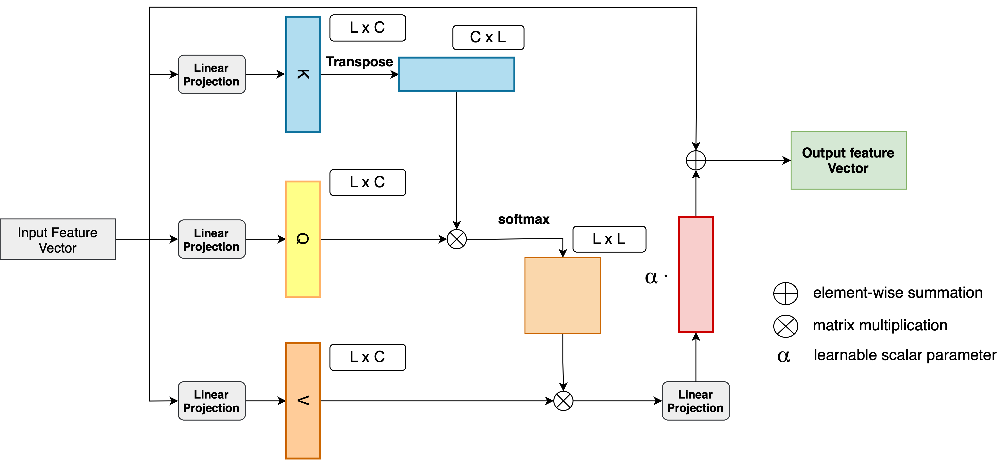

# KFANet: Key-Frame Attention Model


In this repository we provide the code for using KFANet: Key-Frame Attention Model. We provide the training
script in new_main.py and data loader with data augmentations in fetal_loader.py.



To install dependencies:

```shell
pip install -r requirements.txt
```

To run the training code with default parameters, prepare the dataloader and run:

```shell
python new_main.py
```
